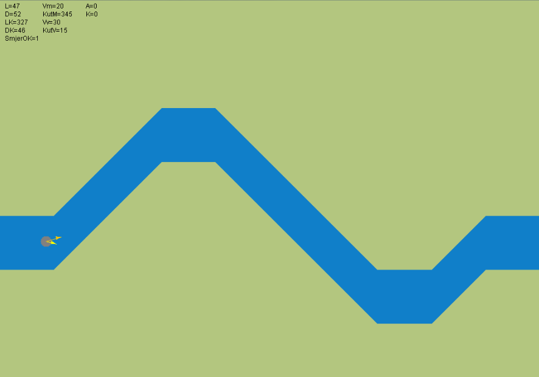
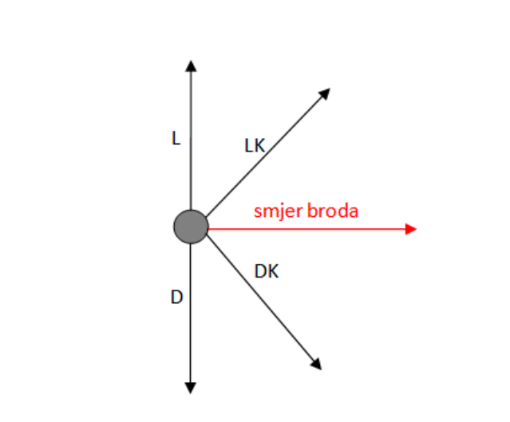

# Shipwreck (croatian _Brodolom_)

This program is written for _Fuzzy, Evolutionary and Neuro-computing_ course held by professor Marko Čupić. The program operates a ship using fuzzy logic. Ship and terrain can be viewed in an image below.
Ship has 5 proximity sensors shown in an image below, with direction of a ship painted red. Wind can affect speed and direction of the ship. Boats' rudder and acceleration can be controlled. 

Acceleration rules are in `java.fer.nenr.fuzzycontrol.rule.AccelerationRules` class, and rudder rules are in `java.fer.nenr.fuzzycontrol.rule.RudderRules`.

## Things to look for

Look at the code of Acceleration and Rudder rules, ParameterChooser.java and where it is used, BoatPremise and BoatConclusion classes to get insight in premises and conclusions.  

Package `...sets.fuzzy` and `...sets.relations` are the backbone of fuzzy arithmetic.

Package `...fuzzycontrol` is essential for understanding used fuzzy logic.

Task of the course is written in `zad3.pdf` file. 

## Images

